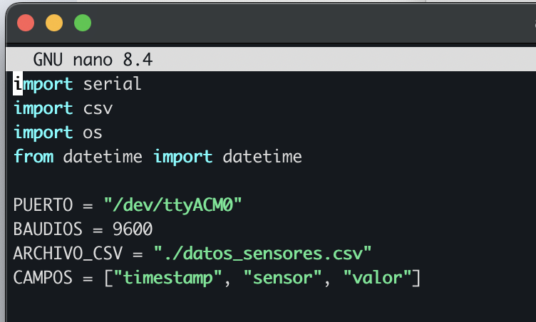
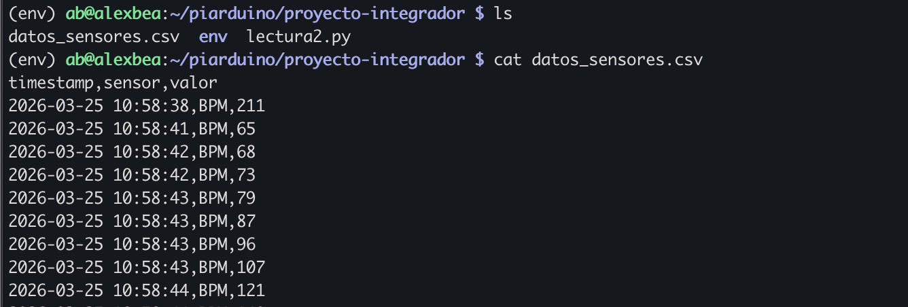
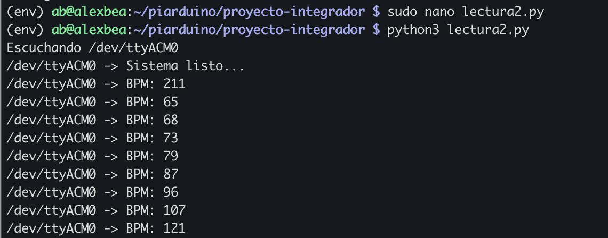
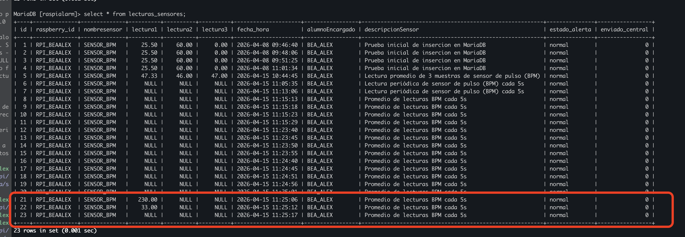

# Proyecto-Integrado
Vamos a crear un sistema de sensores usando raspberry que puede medir muchas características físicas de un paciente. Los datos se guardarán en un servidor central para analisis usando una IA para analizar el estado de un paciente. 

# Método de desarrollo de proyecto

## Requisitos

## Analisis

## Diseño

## Implementación 

## Pruebas

## Implementación


# Arquitectura mental

## Sensor

## Arduino

## USB

## Servidor (PC)

## Archivo CSV


# Sensor: Electrocardíaco

### 1. Descripción
- una herramienta electrocardíaca mida las pulsas electricas del corazón y usa sensores eléctricos sobre puntos clave en el cuerpo


- el movimiento del corazón se divide en 2 fases: PR y QT
- PR es antes de la contracción 
- QT mientras antes de la contracción

#### Para calcular la frecuencia cardíaca 
- El arduino nos da un voltaje en minivoltios cómo medida 
valores 
- se mide entre 0 y 1023 voltios
- El sensor que usamos normalmente tiene un range entre 300 y 700 voltios
- para obtener una medida más adecuada tenemos que añadir filtros para quitar el ruido y hacer la curva más suave
- Hay varias librerías en arduino que miden PPM y arreglan la curva


...

### 2. Especificaciones técnicas
#### Descripción Pines
- GND - tierra
- 3.3v - fuente de alimentación 
- OUTPUT - conexión de entrada analógica
- Leads off + - comprobación de polo norte
- Leads off - - comprobación de polo sur

#### Diagrama sencilla del cableado


#### Diagrama más sencilla sin breadboard (directamente al arduino)


...

### 3. Conexionado

- esquema que se conecta directamente al arduino 


- pruebas de sensores sobre el cuerpo

...

### 4. Código y pruebas
#### codigo deteccion impulsos electricos
```c++
void setup(){
// Inicializar la comunicación en serie:
Serial.begin(9600);
pinMode(10, INPUT); // Configuración para la detección LO +
pinMode(11, INPUT); // Configuración para la detección LO -
}
void loop() {
if((digitalRead(10) == 1)||(digitalRead(11) == 1)){
Serial.println('!');
}
else{
// Imprimir la lectura del puerto A0
Serial.println(analogRead(A0));
}
//Espere un poco para evitar que los datos en serie se saturen
delay(1);
}
```

- Este código es un script sencillo que saca valores ACM (el voltaje en algún instante). No obstante, este valor produce datos crudos que no corresponden a valores actuales de PPM. Hay que modificar el código, usando una librería de arduino para procesar los datos.

- representación gráfica de los resultados que no son en PPM


#### Código final que usa una librería

```c++
#include <PulseSensorPlayground.h>

const int PulseWire = A0;   // Salida del AD8232
const int LO_PLUS = 10;
const int LO_MINUS = 11;
const int LED = 13;         // LED parpadea con cada latido
int Threshold = 550;        // AJUSTAR según tu señal
PulseSensorPlayground pulseSensor;
void setup() {
  Serial.begin(115200); //Valor antiguo 115200 caracteres raros
  /*
  o bien cambiamos la velocidad de los baudios en el serial plotter a 115200
  o bien lo cambiamos en el codigo a 9600
  */
  pinMode(LO_PLUS, INPUT);
  pinMode(LO_MINUS, INPUT);
  pulseSensor.analogInput(PulseWire);
  pulseSensor.blinkOnPulse(LED);
  pulseSensor.setThreshold(Threshold);
  if (pulseSensor.begin()) {
    Serial.println("Sistema listo...");
  }
}
void loop() {
  int signal = analogRead(PulseWire);
  //Serial.println(signal);
  int myBPM = pulseSensor.getBeatsPerMinute();
  if (pulseSensor.sawStartOfBeat()) {
    Serial.print("BPM: ");
    Serial.println(myBPM);
  }}
  delay(20);

  ```

- Introducimos la librería Pulse Sensor Playground que hace la mayoría del trabajo - hemos bajado el baud para tener resultados un poco más fijos y la función  

```c++
pulseSensor.getBeatsPerMinute
``` 

convierte los valores ADM en valores de PPM. El script empieza cuando se detecta un pulso y sale a la pantalla cada 20 milisegundos. 
[Alt text](lecturasFinales.png)
- Sacamos resultados más o menos razonables para una persona normal. 


#### Creando script python que guarda los datos en CSV
```python
pip3 --version
pip3 install pyserial
```


```python
import serial
from datetime import datetime
import csv
#Open a csv file and set it up to receive comma delimited input
logging = open('logging.csv',mode='a')
writer = csv.writer(logging, delimiter=",", escapechar=' ', quoting=csv.QUOTE_NONE)
#Open a serial port that is connected to an Arduino (below is Linux, Windows and Mac would be "COM4" or similar)
#No timeout specified; program will wait until all serial data is received from Arduino
#Port description will vary according to operating system. Linux will be in the form /dev/ttyXXXX
#Windows and MAC will be COMX. Use Arduino IDE to find out name 'Tools -> Port'
ser = serial.Serial('/dev/cu.usbmodem141201', 9600)
ser.flushInput()
#Write out a single character encoded in utf-8; this is defalt encoding for Arduino serial comms
#This character tells the Arduino to start sending data
ser.write(bytes('x', 'utf-8'))
while True:
    #Read in data from Serial until \n (new line) received
    ser_bytes = ser.readline()
    print(ser_bytes)
    
    #Convert received bytes to text format
    decoded_bytes = (ser_bytes[0:len(ser_bytes)-2].decode("utf-8"))
    print(decoded_bytes)
    
    #Retreive current time
    c = datetime.now()
    current_time = c.strftime('%H:%M:%S')
    print(current_time)
    
    #If Arduino has sent a string "stop", exit loop
    if (decoded_bytes == "stop"):
         break
    
    #Write received data to CSV file
    writer.writerow([current_time,decoded_bytes])
            
# Close port and CSV file to exit
ser.close()
logging.close()
print("logging finished")
```


[Link text](https://www.instructables.com/Capture-Data-From-Arduino-to-CSV-File-Using-PySeri/)
- Sacamos el código de este tutorial cambiando el puerto al que estamos usando en el arduino. Se crea un archivo logging con el csv
[Alt text](logging.png)

11:21:45,  230
11:21:45,BPM:  230
11:21:45,BPM:  230
11:21:45,BPM:  230
11:21:45,BPM:  230
11:21:45,BPM:  230
11:21:45,BPM:  230
11:21:45,BPM:  230
11:21:45,BPM:  230
11:21:45,BPM:  230
11:21:45,BPM:  230
11:21:45,BPM:  230


...


### 6. Aplicación en RaspiAlarm
- Vamos a integrar varios sensores usando raspberry como cerebro central

...

# Raspberry - configuración inicial

## Inicial
Lab2_ciberkaos
Asir_2025
ab 22571784


1. Raspberry Imager - darle OS, información sobre red, habilitar ssh
- ssh ab@192.168.1.184
- sudo apt update && sudo apt upgrade -y

2. Servicios
- sudo apt install apache2
- sudo apt install python3 && sudo apt install python3-pip
- sudo apt install mariadb-server (mysql no está disponible en raspbian)


3. Conexion de arduino con raspberry
- `lsusb` para comprobar que el arduino lo tenemos conectado
- `ls -la /dev/serial/by-id/` -> obtenemos el serial en el que tenemos conectado el arduino a la rasp

- ejecutamos el script py conectándonos al puerto del arduino desde el raspberry


# Python en raspberry
1. Crear una carpeta en ~/piarduino/proyecto-integrador que tiene todas las librerias necesarias (pip, os etc) para no tener conflictos
[alt text](crearLiberias.png)
2. Copiamos el script anterior de python y lo pegamos en un archivo en esa carpeta
3. Cambiamos el puerto en el script

4. Ejecutamos


-se ha creado y guardado el archivo exitosamente

# Integrar lecturas en Mariadb
- creación de bases de datos y tabla
```mysql
MariaDB [(none)]> create database if not exists raspialarm
    -> ;
Query OK, 1 row affected (0.005 sec)

MariaDB [(none)]> show databases;
+--------------------+
| Database           |
+--------------------+
| information_schema |
| mariamiamor        |
| mysql              |
| performance_schema |
| raspialarm         |
| sys                |
+--------------------+
6 rows in set (0.004 sec)

MariaDB [(none)]> use raspialarm;
Database changed
MariaDB [raspialarm]> CREATE TABLE lecturas_sensores (
    ->     id INT AUTO_INCREMENT PRIMARY KEY,
    ->     raspberry_id VARCHAR(50) NOT NULL,
    ->     nombresensor VARCHAR(100) NOT NULL,
    ->     lectura1 DECIMAL(10,2),
    ->     lectura2 DECIMAL(10,2),
    ->     lectura3 DECIMAL(10,2),
    ->     fecha_hora DATETIME NOT NULL,
    ->     alumnoEncargado VARCHAR(100) NOT NULL,
    ->     descripcionSensor VARCHAR(255),
    ->     estado_alerta VARCHAR(20) NOT NULL DEFAULT 'normal',
    ->     enviado_central TINYINT(1) NOT NULL DEFAULT 0
    -> );
Query OK, 0 rows affected (0.034 sec)

MariaDB [raspialarm]> describe lecturas_sensores;
+-------------------+---------------+------+-----+---------+----------------+
| Field             | Type          | Null | Key | Default | Extra          |
+-------------------+---------------+------+-----+---------+----------------+
| id                | int(11)       | NO   | PRI | NULL    | auto_increment |
| raspberry_id      | varchar(50)   | NO   |     | NULL    |                |
| nombresensor      | varchar(100)  | NO   |     | NULL    |                |
| lectura1          | decimal(10,2) | YES  |     | NULL    |                |
| lectura2          | decimal(10,2) | YES  |     | NULL    |                |
| lectura3          | decimal(10,2) | YES  |     | NULL    |                |
| fecha_hora        | datetime      | NO   |     | NULL    |                |
| alumnoEncargado   | varchar(100)  | NO   |     | NULL    |                |
| descripcionSensor | varchar(255)  | YES  |     | NULL    |                |
| estado_alerta     | varchar(20)   | NO   |     | normal  |                |
| enviado_central   | tinyint(1)    | NO   |     | 0       |                |
+-------------------+---------------+------+-----+---------+----------------+
11 rows in set (0.003 sec)

MariaDB [raspialarm]> show create table lecturas_sensores;
+-------------------+---------------------------------------------------------------------------------------------------------------------------------------------------------------------------------------------------------------------------------------------------------------------------------------------------------------------------------------------------------------------------------------------------------------------------------------------------------------------------------------------------------------------------------------------------------------------------------------------------------------------------+
| Table             | Create Table                                                                                                                                                                                                                                                                                                                                                                                                                                                                                                                                                                                                              |
+-------------------+---------------------------------------------------------------------------------------------------------------------------------------------------------------------------------------------------------------------------------------------------------------------------------------------------------------------------------------------------------------------------------------------------------------------------------------------------------------------------------------------------------------------------------------------------------------------------------------------------------------------------+
| lecturas_sensores | CREATE TABLE `lecturas_sensores` (
  `id` int(11) NOT NULL AUTO_INCREMENT,
  `raspberry_id` varchar(50) NOT NULL,
  `nombresensor` varchar(100) NOT NULL,
  `lectura1` decimal(10,2) DEFAULT NULL,
  `lectura2` decimal(10,2) DEFAULT NULL,
  `lectura3` decimal(10,2) DEFAULT NULL,
  `fecha_hora` datetime NOT NULL,
  `alumnoEncargado` varchar(100) NOT NULL,
  `descripcionSensor` varchar(255) DEFAULT NULL,
  `estado_alerta` varchar(20) NOT NULL DEFAULT 'normal',
  `enviado_central` tinyint(1) NOT NULL DEFAULT 0,
  PRIMARY KEY (`id`)
) ENGINE=InnoDB DEFAULT CHARSET=utf8mb4 COLLATE=utf8mb4_uca1400_ai_ci |
+-------------------+---------------------------------------------------------------------------------------------------------------------------------------------------------------------------------------------------------------------------------------------------------------------------------------------------------------------------------------------------------------------------------------------------------------------------------------------------------------------------------------------------------------------------------------------------------------------------------------------------------------------------+
MariaDB [raspialarm]> CREATE USER 'raspiuser'@'localhost' IDENTIFIED BY 'raspi1234';
Query OK, 0 rows affected (0.005 sec)

MariaDB [raspialarm]> GRANT ALL PRIVILEGES ON raspialarm.* TO 'raspiuser'@'localhost';
Query OK, 0 rows affected (0.003 sec)

MariaDB [raspialarm]> FLUSH PRIVILEGES;
Query OK, 0 rows affected (0.002 sec)

```
```bash
ab@alexbea:~ $ sudo mkdir -p /home/pi/raspialarma/sensores
ab@alexbea:~ $ sudo mkdir -p /home/pi/raspialarma/logs
ab@alexbea:~ $ sudo mkdir -p /home/pi/raspialarma/docs
ab@alexbea:~ $ ls -R /home/pi/raspialarma
/home/pi/raspialarma:
docs  logs  sensores

/home/pi/raspialarma/docs:

/home/pi/raspialarma/logs:

/home/pi/raspialarma/sensores:
```


```bash
sudo apt install python3-pip python3-mysqldb -y
sudo touch /home/pi/raspialarma/sensores/captura_sensor.py

```

## prueba inicial para insercion de datos

```py
#!/usr/bin/env python3

import MySQLdb
from datetime import datetime

def escribir_log(mensaje):
    with open("/home/pi/raspialarma/logs/raspialarma.log", "a") as log:
        log.write(f"{datetime.now()} - {mensaje}\n")

try:
    conexion = MySQLdb.connect(
        host="localhost",
        user="raspiuser",
        passwd="raspi1234",
        db="raspialarm"
    )

    cursor = conexion.cursor()

    raspberry_id = "RPI_BEAALEX"
    nombresensor = "SENSOR_BPM"
    lectura1 = 25.50
    lectura2 = 60.00
    lectura3 = 0.00
    fecha_hora = datetime.now().strftime("%Y-%m-%d %H:%M:%S")
    alumnoEncargado = "BEA_ALEX"
    descripcionSensor = "Prueba inicial de inserción en MariaDB"
    estado_alerta = "normal"
    enviado_central = 0

    sql = """
        INSERT INTO lecturas_sensores
        (raspberry_id, nombresensor, lectura1, lectura2, lectura3, fecha_hora,
         alumnoEncargado, descripcionSensor, estado_alerta, enviado_central)
        VALUES (%s, %s, %s, %s, %s, %s, %s, %s, %s, %s)
    """

    valores = (
        raspberry_id,
        nombresensor,
        lectura1,
        lectura2,
        lectura3,
        fecha_hora,
        alumnoEncargado,
        descripcionSensor,
        estado_alerta,
        enviado_central
    )

    cursor.execute(sql, valores)
    conexion.commit()

    mensaje = "Lectura guardada correctamente."
    print(mensaje)
    escribir_log(mensaje)

except Exception as e:
    error = f"Error: {e}"
    print(error)
    escribir_log(error)

finally:
    try:
        cursor.close()
        conexion.close()
    except:
        pass
```

- Despues de creasr el script tendremos qe darle permisos, y ademas darle permisos al archivo de logs, para que el script de python sea capaz de modificar el archivo


`ab@alexbea:/home/pi/raspialarma/logs $ cat raspialarma.log 
2026-04-08 09:51:25.599453 - Lectura guardada correctamente.`

```sql
Database changed
MariaDB [raspialarm]> select * from lecturas_sensores;
+----+--------------+--------------+----------+----------+----------+---------------------+-----------------+----------------------------------------+---------------+-----------------+
| id | raspberry_id | nombresensor | lectura1 | lectura2 | lectura3 | fecha_hora          | alumnoEncargado | descripcionSensor                      | estado_alerta | enviado_central |
+----+--------------+--------------+----------+----------+----------+---------------------+-----------------+----------------------------------------+---------------+-----------------+
|  1 | RPI_BEAALEX  | SENSOR_BPM   |    25.50 |    60.00 |     0.00 | 2026-04-08 09:46:40 | BEA_ALEX        | Prueba inicial de insercion en MariaDB | normal        |               0 |
|  2 | RPI_BEAALEX  | SENSOR_BPM   |    25.50 |    60.00 |     0.00 | 2026-04-08 09:48:06 | BEA_ALEX        | Prueba inicial de insercion en MariaDB | normal        |               0 |
|  3 | RPI_BEAALEX  | SENSOR_BPM   |    25.50 |    60.00 |     0.00 | 2026-04-08 09:51:25 | BEA_ALEX        | Prueba inicial de insercion en MariaDB | normal        |               0 |
+----+--------------+--------------+----------+----------+----------+---------------------+-----------------+----------------------------------------+---------------+-----------------+
3 rows in set (0.001 sec)
```


##### Para la activacion del entorno en python 
```bash
source env/bin/activate
```






---

## Prueba real de incorporación de datos 
- Instalamos mysql python connector
```python
pip install mysql-connector-python
```
- creamos un script que integra los 2 scripts anteriores (sensores y mysql) para subir las lecturas directamente a la base de datos
```python
#!/usr/bin/env python3
import serial
import mysql.connector
from mysql.connector import Error
from datetime import datetime
import time

# ============ CONFIGURATION ============
PUERTO = "/dev/ttyACM0"
BAUDIOS = 9600
INTERVALO_SEG = 5  # average and insert every 5 seconds

DB_CONFIG = {
    "host": "localhost",
    "user": "raspiuser",
    "password": "raspi1234",
    "database": "raspialarm"
}

RASPBERRY_ID = "RPI_BEAALEX"
ALUMNO_ENCARGADO = "BEA_ALEX"
DESCRIPCION_SENSOR = "Promedio de lecturas BPM cada 5s"
ESTADO_ALERTA = "normal"

LOG_FILE = "/home/pi/raspialarma/logs/raspialarma.log"
TABLE_NAME = "lecturas_sensores"

# ============ FUNCTIONS ============

def escribir_log(mensaje):
    try:
        with open(LOG_FILE, "a") as log:
            timestamp = datetime.now().strftime('%Y-%m-%d %H:%M:%S')
            log.write(f"{timestamp} - {mensaje}\n")
    except Exception as e:
        print(f"Error escribiendo log: {e}")

def parsear_linea(linea):
    if "BPM:" in linea:
        try:
            partes = linea.split(":")
            if len(partes) == 2:
                return float(partes[1].strip())
        except ValueError:
            escribir_log(f"Error parseando valor BPM: {linea}")
    return None

def conectar_db():
    try:
        conexion = mysql.connector.connect(**DB_CONFIG)
        if conexion.is_connected():
            escribir_log("Conexión a MariaDB establecida")
            return conexion
    except Error as e:
        escribir_log(f"Error conectando a base de datos: {e}")
        return None

def insertar_promedio(conexion, promedio):
    if not conexion or not conexion.is_connected():
        conexion = conectar_db()
        if not conexion:
            return False, conexion
    try:
        cursor = conexion.cursor()
        sql = f"""
            INSERT INTO {TABLE_NAME}
            (raspberry_id, nombresensor, lectura1, lectura2, lectura3, fecha_hora,
             alumnoEncargado, descripcionSensor, estado_alerta, enviado_central)
            VALUES (%s, %s, %s, %s, %s, %s, %s, %s, %s, %s)
        """
        valores = (
            RASPBERRY_ID,
            "SENSOR_BPM",
            float(promedio) if promedio is not None else None,
            None,
            None,
            datetime.now().strftime("%Y-%m-%d %H:%M:%S"),
            ALUMNO_ENCARGADO,
            DESCRIPCION_SENSOR,
            ESTADO_ALERTA,
            0
        )
        cursor.execute(sql, valores)
        conexion.commit()
        cursor.close()
        if promedio is None:
            escribir_log("Insertado promedio NULL (no lecturas en el intervalo)")
            print("✓ Insertado fila con lectura NULL")
        else:
            escribir_log(f"Insertado promedio {promedio:.1f}")
            print(f"✓ Insertado promedio {promedio:.1f}")
        return True, conexion
    except Error as e:
        escribir_log(f"Error insertando en base de datos: {e}")
        print(f"✗ Error insertando en DB: {e}")
        return False, conexion

# ============ MAIN ============

def main():
    conexion = conectar_db()
    if not conexion:
        print("ERROR: No se pudo conectar a la base de datos. Abortando.")
        escribir_log("FALLO: No se pudo conectar a la base de datos al iniciar")
        return

    try:
        ser = serial.Serial(PUERTO, BAUDIOS, timeout=1)
        escribir_log(f"Puerto serie abierto: {PUERTO}")
        print(f"✓ Escuchando en {PUERTO} a {BAUDIOS} baud...")
        print(f"Promediando lecturas cada {INTERVALO_SEG} segundos. Presiona Ctrl+C para detener.\n")

        buffer_vals = []
        window_start = time.time()

        while True:
            try:
                raw = ser.readline()
            except serial.SerialException as e:
                escribir_log(f"Error leyendo puerto serie: {e}")
                print(f"✗ Error leyendo puerto serie: {e}")
                time.sleep(1)
                continue

            if raw:
                try:
                    linea = raw.decode("utf-8", errors="ignore").strip()
                except UnicodeDecodeError:
                    escribir_log("Error decodificando datos serial")
                    linea = None

                if linea:
                    val = parsear_linea(linea)
                    if val is not None:
                        buffer_vals.append(val)
                        print(f"[{datetime.now().strftime('%H:%M:%S')}] Lectura capturada: {val:.1f} (buffer {len(buffer_vals)})")

            now = time.time()
            if now - window_start >= INTERVALO_SEG:
                promedio = sum(buffer_vals) / len(buffer_vals) if buffer_vals else None
                if promedio is not None:
                    print(f"\n>>> Intervalo terminado. Promedio = {promedio:.1f}")
                else:
                    print("\n>>> Intervalo terminado. Sin lecturas -> INSERT NULL")
                exito, conexion = insertar_promedio(conexion, promedio)
                if not exito:
                    escribir_log("Fallo inserción; se intentará reconectar para el siguiente ciclo")
                    conexion = conectar_db()
                buffer_vals = []
                window_start = now

            time.sleep(0.05)

    except FileNotFoundError:
        print(f"ERROR: Puerto {PUERTO} no encontrado")
        escribir_log(f"ERROR: Puerto {PUERTO} no encontrado")
    except KeyboardInterrupt:
        escribir_log("Programa detenido por usuario (Ctrl+C)")
        print("\n\n✓ Programa detenido correctamente")
    except Exception as e:
        escribir_log(f"Error inesperado: {e}")
        print(f"✗ Error inesperado: {e}")
    finally:
        try:
            if ser and ser.is_open:
                ser.close()
                print("✓ Puerto serie cerrado")
        except NameError:
            pass
        if conexion and conexion.is_connected():
            conexion.close()
            escribir_log("Conexión a base de datos cerrada")
            print("✓ Conexión a base de datos cerrada")

if __name__ == "__main__":
    main()
```
- El script coge un promedio cada 5 segundos y inserta el valor en un registro


- Aquí hemos logrado lecturas iniciales en vivo, vamos a seguir refinando las lecturas porque tenemos que ajustar dónde se pone los sensores en el cuerpo

## Crear una interfaz gráfica de web
```bash
sudo systemctl status apache2
#versión activado
sudo systemctl status mariadb
#version activado
sudo apt install php
php -v
```

### Crear estructura
```bash
sudo mkdir -p /var/www/html/raspialarma
sudo chown -R $USER:$USER /var/www/html/raspialarma
nano conexion.php
```
```php
<?php
$host = "localhost";
$usuario = "raspiuser";
$contrasena = "raspi1234";
$basedatos = "raspialarm";

$conexion = new mysqli($host, $usuario, $contrasena, $basedatos);

if ($conexion->connect_error) {
    die("Error de conexión: " . $conexion->connect_error);
}

$conexion->set_charset("utf8");
?>
```
```bash
nano listar.php
```
```php
<?php
include("conexion.php");

$sql = "SELECT * FROM lecturas_sensores ORDER BY fecha_hora DESC";
$resultado = $conexion->query($sql);
?>

<!DOCTYPE html>
<html lang="es">
<head>
    <meta charset="UTF-8">
    <title>Lecturas RaspyAlarma</title>
</head>
<body>

<h1>Lecturas almacenadas en RaspyAlarma</h1>

<?php
if ($resultado->num_rows > 0) {
    echo "<table border='1' cellpadding='5' cellspacing='0'>";
    echo "<tr>
            <th>ID</th>
            <th>Raspberry</th>
            <th>Sensor</th>
            <th>Lectura 1</th>
            <th>Lectura 2</th>
            <th>Lectura 3</th>
            <th>Fecha y hora</th>
            <th>Alumno</th>
            <th>Descripción</th>
            <th>Estado alerta</th>
            <th>Enviado central</th>
          </tr>";

    while ($fila = $resultado->fetch_assoc()) {
        echo "<tr>";
        echo "<td>" . $fila["id"] . "</td>";
        echo "<td>" . $fila["raspberry_id"] . "</td>";
        echo "<td>" . $fila["nombresensor"] . "</td>";
        echo "<td>" . $fila["lectura1"] . "</td>";
        echo "<td>" . $fila["lectura2"] . "</td>";
        echo "<td>" . $fila["lectura3"] . "</td>";
        echo "<td>" . $fila["fecha_hora"] . "</td>";
        echo "<td>" . $fila["alumnoEncargado"] . "</td>";
        echo "<td>" . $fila["descripcionSensor"] . "</td>";
        echo "<td>" . $fila["estado_alerta"] . "</td>";
        echo "<td>" . $fila["enviado_central"] . "</td>";
        echo "</tr>";
    }

    echo "</table>";
} else {
    echo "<p>No hay registros en la base de datos.</p>";
}

$conexion->close();
?>

</body>
</html>
```
