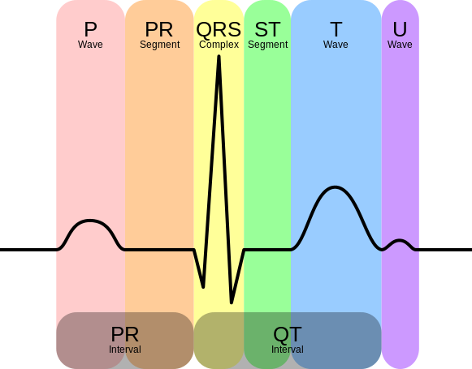
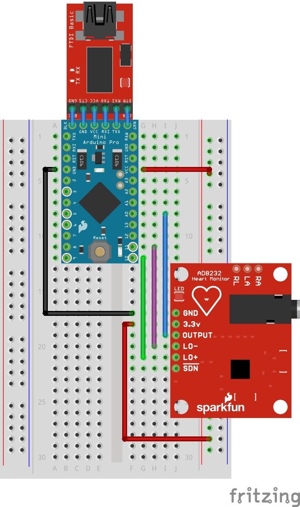
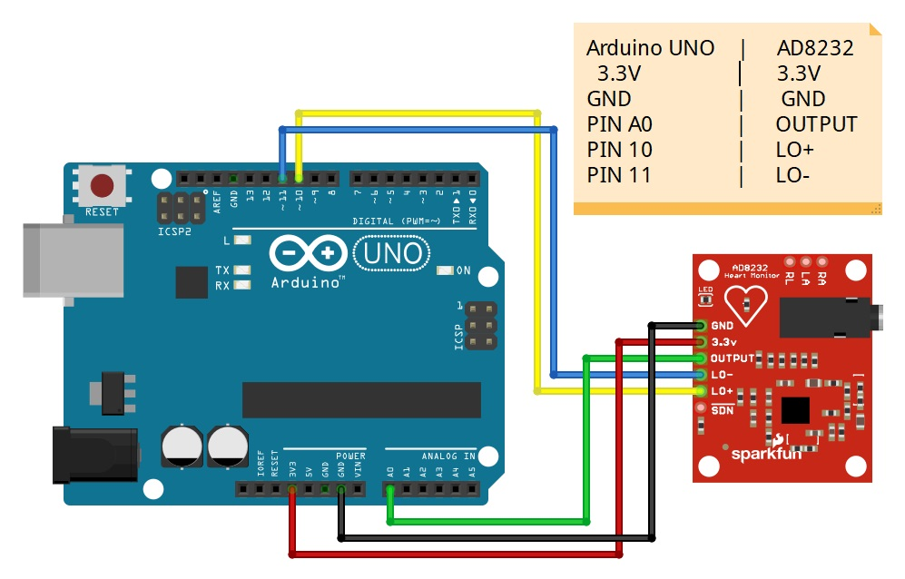
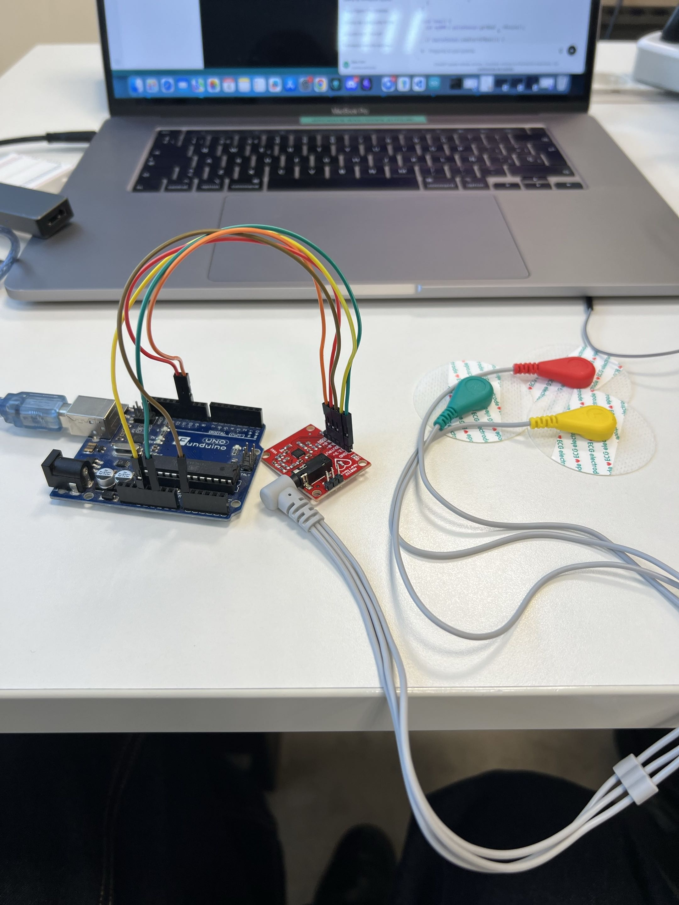
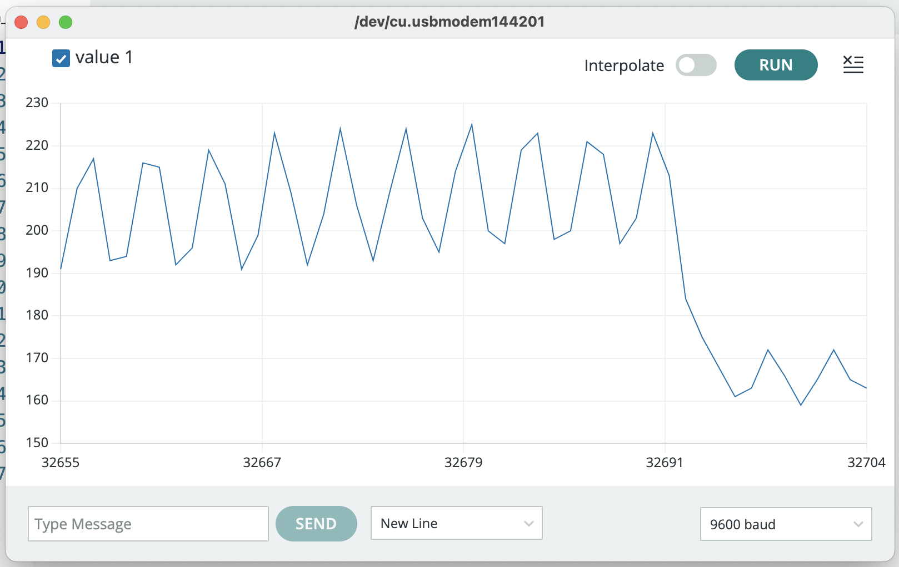

# Proyecto-Integrado
Vamos a crear un sistema de sensores usando raspberry que puede medir muchas características físicas de un paciente. Los datos se guardarán en un servidor central para analisis usando una IA para analizar el estado de un paciente. 

# Método de desarrollo de proyecto

## Requisitos

## Analisis

## Diseño

## Implementación 

## Pruebas

## Implementación


# Arquitectura mental

## Sensor

## Arduino

## USB

## Servidor (PC)

## Archivo CSV


# Sensor: Electrocardíaco

### 1. Descripción
- una herramienta electrocardíaca mida las pulsas electricas del corazón y usa sensores eléctricos sobre puntos clave en el cuerpo


- el movimiento del corazón se divide en 2 fases: PR y QT
- PR es antes de la contracción 
- QT mientras antes de la contracción

#### Para calcular la frecuencia cardíaca 
- El arduino nos da un voltaje en minivoltios cómo medida 
valores 
- se mide entre 0 y 1023 voltios
- El sensor que usamos normalmente tiene un range entre 300 y 700 voltios
- para obtener una medida más adecuada tenemos que añadir filtros para quitar el ruido y hacer la curva más suave
- Hay varias librerías en arduino que miden PPM y arreglan la curva


...

### 2. Especificaciones técnicas
#### Descripción Pines
- GND - tierra
- 3.3v - fuente de alimentación 
- OUTPUT - conexión de entrada analógica
- Leads off + - comprobación de polo norte
- Leads off - - comprobación de polo sur

#### Diagrama sencilla del cableado


#### Diagrama más sencilla sin breadboard (directamente al arduino)



...

### 3. Conexionado

- esquema que se conecta directamente al arduino 


- pruebas de sensores sobre el cuerpo

...

### 4. Código y pruebas
#### codigo deteccion impulsos electricos
```c++
void setup(){
// Inicializar la comunicación en serie:
Serial.begin(9600);
pinMode(10, INPUT); // Configuración para la detección LO +
pinMode(11, INPUT); // Configuración para la detección LO -
}
void loop() {
if((digitalRead(10) == 1)||(digitalRead(11) == 1)){
Serial.println('!');
}
else{
// Imprimir la lectura del puerto A0
Serial.println(analogRead(A0));
}
//Espere un poco para evitar que los datos en serie se saturen
delay(1);
}
```

- Este código es un script sencillo que saca valores ACM (el voltaje en algún instante). No obstante, este valor produce datos crudos que no corresponden a valores actuales de PPM. Hay que modificar el código, usando una librería de arduino para procesar los datos.

- representación gráfica de los resultados que no son en PPM


#### Código final que usa una librería

```c++
#include <PulseSensorPlayground.h>

const int PulseWire = A0;   // Salida del AD8232
const int LO_PLUS = 10;
const int LO_MINUS = 11;
const int LED = 13;         // LED parpadea con cada latido
int Threshold = 550;        // AJUSTAR según tu señal
PulseSensorPlayground pulseSensor;
void setup() {
  Serial.begin(115200); //Valor antiguo 115200 caracteres raros
  /*
  o bien cambiamos la velocidad de los baudios en el serial plotter a 115200
  o bien lo cambiamos en el codigo a 9600
  */
  pinMode(LO_PLUS, INPUT);
  pinMode(LO_MINUS, INPUT);
  pulseSensor.analogInput(PulseWire);
  pulseSensor.blinkOnPulse(LED);
  pulseSensor.setThreshold(Threshold);
  if (pulseSensor.begin()) {
    Serial.println("Sistema listo...");
  }
}
void loop() {
  int signal = analogRead(PulseWire);
  //Serial.println(signal);
  int myBPM = pulseSensor.getBeatsPerMinute();
  if (pulseSensor.sawStartOfBeat()) {
    Serial.print("BPM: ");
    Serial.println(myBPM);
  }}
  delay(20);

  ```

- Introducimos la librería Pulse Sensor Playground que hace la mayoría del trabajo - hemos bajado el baud para tener resultados un poco más fijos y la función  

```c++
pulseSensor.getBeatsPerMinute
``` 

convierte los valores ADM en valores de PPM. El script empieza cuando se detecta un pulso y sale a la pantalla cada 20 milisegundos. 
[Alt text](lecturasFinales.png)
- Sacamos resultados más o menos razonables para una persona normal. 


#### Creando script python que guarda los datos en CSV
```python
pip3 --version
pip3 install pyserial
```


```python
import serial
from datetime import datetime
import csv
#Open a csv file and set it up to receive comma delimited input
logging = open('logging.csv',mode='a')
writer = csv.writer(logging, delimiter=",", escapechar=' ', quoting=csv.QUOTE_NONE)
#Open a serial port that is connected to an Arduino (below is Linux, Windows and Mac would be "COM4" or similar)
#No timeout specified; program will wait until all serial data is received from Arduino
#Port description will vary according to operating system. Linux will be in the form /dev/ttyXXXX
#Windows and MAC will be COMX. Use Arduino IDE to find out name 'Tools -> Port'
ser = serial.Serial('/dev/cu.usbmodem141201', 9600)
ser.flushInput()
#Write out a single character encoded in utf-8; this is defalt encoding for Arduino serial comms
#This character tells the Arduino to start sending data
ser.write(bytes('x', 'utf-8'))
while True:
    #Read in data from Serial until \n (new line) received
    ser_bytes = ser.readline()
    print(ser_bytes)
    
    #Convert received bytes to text format
    decoded_bytes = (ser_bytes[0:len(ser_bytes)-2].decode("utf-8"))
    print(decoded_bytes)
    
    #Retreive current time
    c = datetime.now()
    current_time = c.strftime('%H:%M:%S')
    print(current_time)
    
    #If Arduino has sent a string "stop", exit loop
    if (decoded_bytes == "stop"):
         break
    
    #Write received data to CSV file
    writer.writerow([current_time,decoded_bytes])
            
# Close port and CSV file to exit
ser.close()
logging.close()
print("logging finished")
```


[Link text](https://www.instructables.com/Capture-Data-From-Arduino-to-CSV-File-Using-PySeri/)
- Sacamos el código de este tutorial cambiando el puerto al que estamos usando en el arduino. Se crea un archivo logging con el csv
[Alt text](logging.png)

11:21:45,  230
11:21:45,BPM:  230
11:21:45,BPM:  230
11:21:45,BPM:  230
11:21:45,BPM:  230
11:21:45,BPM:  230
11:21:45,BPM:  230
11:21:45,BPM:  230
11:21:45,BPM:  230
11:21:45,BPM:  230
11:21:45,BPM:  230
11:21:45,BPM:  230


...


### 6. Aplicación en RaspiAlarm
- Vamos a integrar varios sensores usando raspberry como cerebro central

...

# Raspberry - configuración inicial

##
Lab2_ciberkaos
Asir_2025
ab 22571784


1. Raspberry Imager - darle OS, información sobre red, habilitar ssh
- ssh ab@192.168.1.184
- sudo apt update && sudo apt upgrade -y

2. Servicios
- sudo apt install apache2
- sudo apt install python3 && sudo apt install python3-pip
- sudo apt install mariadb-server (mysql no está disponible en raspbian)


3. Conexion de arduino con raspberry
- `lsusb` para comprobar que el arduino lo tenemos conectado
- `ls -la /dev/serial/by-id/` -> obtenemos el serial en el qeu tenemos conectado el arduino a la rasp

- ejecutamos el script py conectándonos al puerto del arduino desde el raspberry


