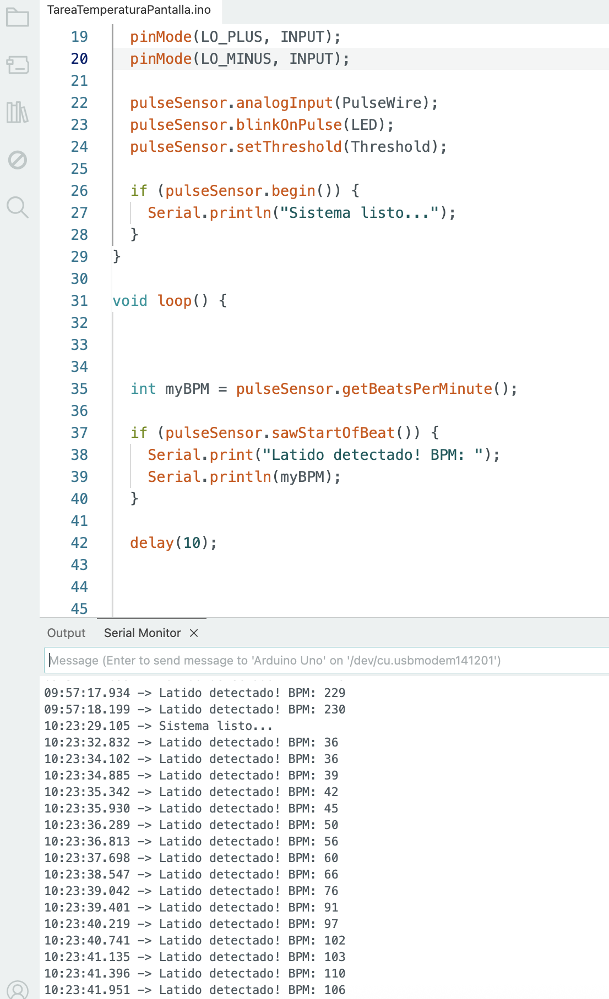

### codigo deteccion impulsos electricos
```c++
void setup(){

// Inicializar la comunicación en serie:

Serial.begin(9600);

pinMode(10, INPUT); // Configuración para la detección LO +

pinMode(11, INPUT); // Configuración para la detección LO -

}

void loop() {

if((digitalRead(10) == 1)||(digitalRead(11) == 1)){

Serial.println('!');

}

else{

// Imprimir la lectura del puerto A0

Serial.println(analogRead(A0));

}

//Espere un poco para evitar que los datos en serie se saturen

delay(1);

}
```

---

### codigo obtencion BPM
se supone que con este codigo empezamos a obtener datos de los bpm - pulsaciones
*cambios aplicados sin aplicar*
```c++
#include <PulseSensorPlayground.h>

const int PulseWire = A0;   // Salida del AD8232
const int LO_PLUS = 10;
const int LO_MINUS = 11;
const int LED = 13;         // LED parpadea con cada latido

int Threshold = 550;        // AJUSTAR según tu señal

PulseSensorPlayground pulseSensor;

void setup() {
  Serial.begin(9600); //ACTUALIZADO PERO NO PROBADO - valor antiguo 115200 caracteres raros
  /*
  o bien cambiamos la velocidad de los baudios en el serial plotter a 115200
  o bien lo cambiamos en el codigo a 9600
  */

  pinMode(LO_PLUS, INPUT);
  pinMode(LO_MINUS, INPUT);

  pulseSensor.analogInput(PulseWire);
  pulseSensor.blinkOnPulse(LED);
  pulseSensor.setThreshold(Threshold);

  if (pulseSensor.begin()) {
    Serial.println("Sistema listo...");
  }
}

void loop() {

  // Verificar si algún electrodo está desconectado
  if (digitalRead(LO_PLUS) == 1 || digitalRead(LO_MINUS) == 1) {
    Serial.println("Electrodo desconectado!");
    return;  // no procesa señal
  }

  int myBPM = pulseSensor.getBeatsPerMinute();

  if (pulseSensor.sawStartOfBeat()) {
    Serial.print("Latido detectado! BPM: ");
    Serial.println(myBPM);
  }

  delay(10);
}
```

### sin LO+ ni LO-
```c++
#include <PulseSensorPlayground.h>

const int PulseWire = A0;   // Salida del AD8232
const int LO_PLUS = 10;
const int LO_MINUS = 11;
const int LED = 13;         // LED parpadea con cada latido

int Threshold = 550;        // AJUSTAR según tu señal

PulseSensorPlayground pulseSensor;

void setup() {
  Serial.begin(115200); //ACTUALIZADO PERO NO PROBADO - valor antiguo 115200 caracteres raros
  /*
  o bien cambiamos la velocidad de los baudios en el serial plotter a 115200
  o bien lo cambiamos en el codigo a 9600
  */

  pinMode(LO_PLUS, INPUT);
  pinMode(LO_MINUS, INPUT);

  pulseSensor.analogInput(PulseWire);
  pulseSensor.blinkOnPulse(LED);
  pulseSensor.setThreshold(Threshold);

  if (pulseSensor.begin()) {
    Serial.println("Sistema listo...");
  }
}

void loop() {


  int myBPM = pulseSensor.getBeatsPerMinute();

  if (pulseSensor.sawStartOfBeat()) {
    Serial.print("Latido detectado! BPM: ");
    Serial.println(myBPM);
  }

  delay(10);
}
```


Leer los BPM actuales del sensor.

Comprobar si se acaba de detectar un latido.

Si lo hay:

imprimir el BPM en el monitor serie.

Esperar 10 ms.

Repetir todo otra vez.





#  CODIGO FINAL


```

#include <PulseSensorPlayground.h>

const int PulseWire = A0;   // Salida del AD8232
const int LO_PLUS = 10;
const int LO_MINUS = 11;
const int LED = 13;         // LED parpadea con cada latido

int Threshold = 550;        // AJUSTAR según tu señal

PulseSensorPlayground pulseSensor;

void setup() {
  Serial.begin(115200); //ACTUALIZADO PERO NO PROBADO - valor antiguo 115200 caracteres raros
  /*
  o bien cambiamos la velocidad de los baudios en el serial plotter a 115200
  o bien lo cambiamos en el codigo a 9600
  */

  pinMode(LO_PLUS, INPUT);
  pinMode(LO_MINUS, INPUT);

  pulseSensor.analogInput(PulseWire);
  pulseSensor.blinkOnPulse(LED);
  pulseSensor.setThreshold(Threshold);

  if (pulseSensor.begin()) {
    Serial.println("Sistema listo...");
  }
}

void loop() {


  int signal = analogRead(PulseWire);
  //Serial.println(signal);

  int myBPM = pulseSensor.getBeatsPerMinute();

  if (pulseSensor.sawStartOfBeat()) {
    Serial.print("BPM: ");
    Serial.println(myBPM);
  }

  delay(20);


  // int myBPM = pulseSensor.getBeatsPerMinute();

  // if (pulseSensor.sawStartOfBeat()) {
  //   //Serial.print("Latido detectado! BPM: ");
  //   //Serial.println(myBPM);
  //   Serial.println(analogRead(PulseWire));
  // }

  // delay(10);


  // // Verificar si algún electrodo está desconectado
  // if (digitalRead(LO_PLUS) == 1 || digitalRead(LO_MINUS) == 1) {
  //   Serial.println("Electrodo desconectado!");
  //   return;  // no procesa señal
  // }

  // int myBPM = pulseSensor.getBeatsPerMinute();

  // if (pulseSensor.sawStartOfBeat()) {
  //   Serial.print("Latido detectado! BPM: ");
  //   Serial.println(myBPM);
  // }

  // delay(10);
}
```